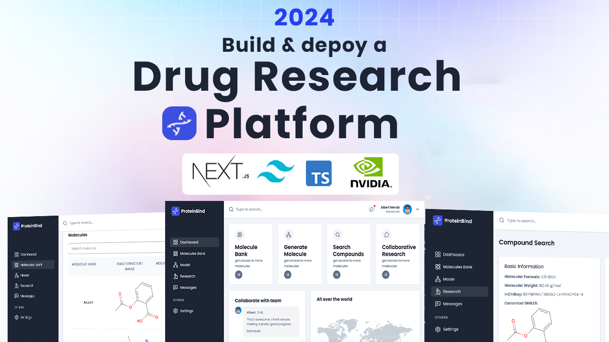

<div align="center">
  <br />
    
  
  <br />

  <div>
    
    
    
    
  </div>

  <h3 align="center">ProteinBind</h3>
  <p align="center">Advanced Drug Discovery Platform</p>
  <p align="center">Created by <strong>JK-77 (Jayesh Kriplani)</strong></p>
</div>

## 📋 Table of Contents

1. 🤖 [Introduction](#introduction)
2. ⚙️ [Tech Stack](#tech-stack)
3. 🔋 [Features](#features)
4. 🤸 [Quick Start](#quick-start)
5. 🧬 [Protein Data Processing](#protein-data)
6. 🚀 [Deployment](#deployment)
7. 📞 [Contact](#contact)

## 🤖 Introduction

**ProteinBind** is a cutting-edge drug discovery and protein-binding prediction platform built with the latest AI/ML technologies. This comprehensive platform enables researchers to simulate molecular interactions, predict protein structures, and accelerate drug discovery processes.

### Key Capabilities:
- **AI-Powered Molecular Generation** using NVIDIA NIM models
- **Real-time Molecular Visualization** with RDKit integration
- **Collaborative Research Environment** with real-time chat
- **Comprehensive Compound Database** with PubChem integration
- **Advanced Analytics** and molecular property prediction

## ⚙️ Tech Stack

### Frontend
- **Next.js 14** with App Router
- **TypeScript** for type safety
- **Tailwind CSS** for styling
- **React 18** with modern hooks

### Backend
- **Express.js** proxy server
- **NVIDIA API** integration
- **MongoDB** with Mongoose
- **NextAuth.js** for authentication

### AI/ML Integration
- **NVIDIA NIM** for protein structure prediction
- **RDKit** for molecular visualization
- **CMA-ES Algorithm** for molecular optimization

## 🔋 Features

### 🧬 Molecular Generation
- Generate novel molecular structures from SMILES strings
- AI-powered optimization using CMA-ES algorithm
- Real-time molecular visualization
- Property scoring and analysis

### 🏦 Molecule Bank
- Curated database of common molecules
- Advanced search and filtering
- Molecular weight and usage categorization
- Interactive structure display

### 🔬 Research Tools
- PubChem API integration
- Comprehensive compound data lookup
- Molecular property analysis
- Structure-activity relationship studies

### 💬 Collaborative Features
- Real-time chat system
- Research group collaboration
- Message history and persistence
- User authentication and profiles

### 📱 User Experience
- Responsive design for all devices
- Dark/light mode support
- Intuitive user interface
- Professional dashboard

## 🤸 Quick Start

### Prerequisites

Make sure you have the following installed:
- [Git](https://git-scm.com/)
- [Node.js](https://nodejs.org/en) (v18 or higher)
- [npm](https://www.npmjs.com/) or [yarn](https://yarnpkg.com/)

### Installation

1. **Clone the repository**
```bash
git clone https://github.com/JK-77/ProteinBindS.git
cd ProteinBindS
```

2. **Install dependencies**
```bash
npm install
```

3. **Set up environment variables**
Create a `.env.local` file in the root directory:
```env
NEXTAUTH_SECRET=your-nextauth-secret-key
NEXTAUTH_URL=http://localhost:3000
MONGODB_URL=mongodb://localhost:27017/proteinBind
NEXT_PUBLIC_NVIDIA_API_KEY=your-nvidia-api-key
ABLY_API_KEY=your-ably-api-key
RESEND_KEY=your-resend-api-key
NEXT_PUBLIC_API_BASE_URL=http://localhost:3000
NEXT_PUBLIC_BACKEND_URL=http://localhost:5050/api/generate
```

4. **Start the development server**
```bash
npm run dev
```

5. **Start the backend server** (in a separate terminal)
```bash
cd backend
npm install
npm start
```

6. **Access the application**
Open [http://localhost:3000](http://localhost:3000) in your browser.

## 🧬 Protein Data Processing

### Molecular Structure Analysis
- **SMILES Input**: Generate molecules from chemical notation
- **Structure Optimization**: AI-powered molecular property optimization
- **Visualization**: Real-time 2D molecular structure rendering
- **Property Prediction**: QED scores and molecular descriptors

### Data Pipeline
- **Input Processing**: SMILES string validation and parsing
- **AI Generation**: NVIDIA API integration for molecular optimization
- **Result Analysis**: Property scoring and similarity analysis
- **Storage**: User history and molecule database

## 🚀 Deployment

### Vercel Deployment (Frontend)
1. Connect your GitHub repository to Vercel
2. Set environment variables in Vercel dashboard
3. Deploy automatically on push to main branch

### Backend Deployment
Deploy the backend server to platforms like:
- **Railway** (recommended)
- **Render**
- **Heroku**

See `VERCEL_DEPLOYMENT.md` for detailed deployment instructions.

## 📞 Contact

**Developer**: JK-77 (Jayesh Kriplani)
- **GitHub**: [@JK-77](https://github.com/JK-77)
- **Email**: jayeshkriplani9@gmail.com

### Support
- **Issues**: [GitHub Issues](https://github.com/JK-77/ProteinBindS/issues)
- **Discussions**: [GitHub Discussions](https://github.com/JK-77/ProteinBindS/discussions)

---

<div align="center">
  <p>Made with ❤️ by <strong>JK-77</strong></p>
  <p>© 2025 ProteinBind. All rights reserved.</p>
</div>